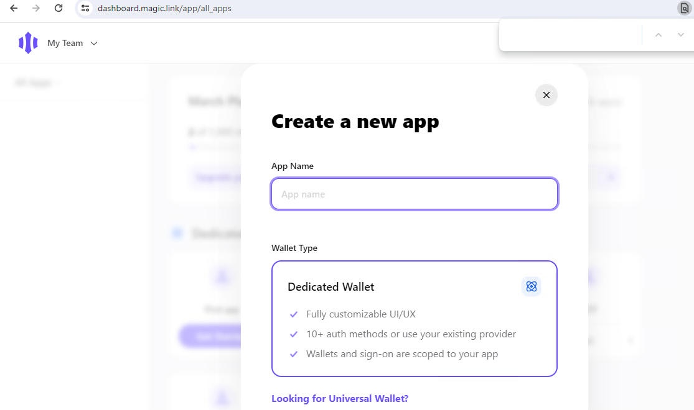

# Getting Started with Create React App

This project was bootstrapped with [Create React App](https://github.com/facebook/create-react-app).

## Available Scripts

In the project directory, you can run:

### `npm install`

If you want to start the app, run `npm start`

### environment variable

Here are 3 env variables.

```t
REACT_APP_CONTRACT = "Dnf8D1JQ4CY5nW146XpDo7DJ7kHvfAtL68V9cdMy7M15"
REACT_APP_MAGIC = "write your magic public key"
REACT_APP_SEED = "write your seed phrase which you will use in this project"
```

### `https://dashboard.magic.link/app/all_apps`




If you want to test with phantom wallet, install extension in your browser.
This APP will automatically detect extensions and will let you connect the app with phantom
If not, then let you signin with email

# after install

Go to [https://faucet.solana.com/] and input your wallet address and set the amount to airdrop and confirm.

With out dev sol, you can't test the project. Because it requires fee to check in

